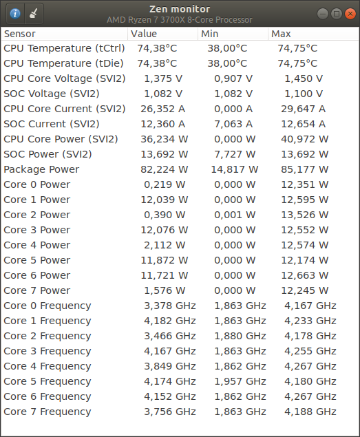

# Zenmonitor3
Zenmonitor3 is monitoring software for AMD Zen-based CPUs.

It can monitor these values:
 - CPU Temperature
 - CPU Core (SVI2) Voltage, Current and Power
 - SOC (SVI2) Voltage, Current and Power
 - Package and Core Power (RAPL)
 - Core Frequency (from OS)



## Dependencies
 - [zenpower3 driver](https://github.com/Ta180m/zenpower3) - For monitoring CPU temperature and SVI2 sensors
 - MSR driver - For monitoring Package/Core Power (RAPL)

Follow [zenpower README.md](https://github.com/Ta180m/zenpower3/blob/master/README.md) to install and activate zenpower module.
Enter `sudo modprobe msr` to enable MSR driver.

## Building 
Make sure that GTK3 dev package and common build tools are installed.
```sh
make
```

## Launching
You can launch app by `sudo ./zenmonitor`, or you can install it to your system and then launch it from your OS menu.

Note: Because superuser privileges are usually needed to access data from MSR driver, you need to launch zenmonitor as root for monitoring CPU power usage (RAPL).
Alternatively, you can set capabilities to zenmonitor executable: `sudo setcap cap_sys_rawio,cap_dac_read_search+ep ./zenmonitor`

## Command line arguments

``--coreid`` - Display core_id instead of core index

## Installing
By default, Zenmonitor3 will be installed to /usr/local.
```sh
sudo make install
```

To add menu item for launching zenpower as root (Polkit is required):
```sh
sudo make install-polkit
```

## Uninstalling
```sh
sudo make uninstall
```

## Setup on Ubuntu
First follow [installation instructions on zenpower3](https://github.com/Ta180m/zenpower3/blob/master/README.md#installation-commands-for-ubuntu)
Then:
```sh
sudo modprobe msr
sudo bash -c 'echo "msr" > /etc/modules-load.d/msr.conf'
sudo apt install build-essential libgtk-3-dev git
cd ~
git clone https://github.com/Ta180m/zenmonitor3
cd zenmonitor
make
sudo make install
sudo make install-polkit
```

## Setup on Arch
You may use the AUR package [zenmonitor3-git](https://aur.archlinux.org/packages/zenmonitor3-git/) to install via [traditional method](https://wiki.archlinux.org/index.php/Arch_User_Repository) or using an AUR helper.
